Offensive LLMOps: Mapping the Temperature Efficiency Curve ($\tau$) for Autonomous Hacking Agents

🎯 Visao Geral
Este estudo investiga o impacto critico do hiperparametro Temperatura ($\tau$) no desempenho de agentes de LLM durante operacoes ofensivas autonomas. Embora LLMs ja tenham demonstrado capacidades estrategicas em simulacoes de ciberataques, a relacao entre estocasticidade e sucesso de intrusao ainda e uma "caixa preta".

O objetivo deste projeto e definir a Stochastic Resonance Zone: o ponto em que o ruido controlado ajuda o agente a escapar de loops logicos sem perder a coerencia sintatica necessaria para executar exploits.

🔬 Hipotese Cientifica
A relacao entre temperatura e sucesso de intrusao tende a seguir uma distribuicao em "U" invertido:

- **Stagnation Zone** ($\tau < 0.3$): rigidez excessiva, loops infinitos e comandos repetidos.
- **Stochastic Resonance Zone** ($0.4 \le \tau \le 0.7$): equilibrio ideal entre criatividade e precisao sintatica.
- **Hallucination Zone** ($\tau > 0.8$): alta entropia, uso de ferramentas inexistentes, CVEs imaginarias e "soliloquizing".

🛠 Metodologia
Agente customizado baseado em Gemini-CLI e no paradigma ReAct (Reasoning + Acting), testado em ambientes controlados.

**Ambientes**
- **Legacy/Network**: Metasploitable 3 (pentest, exploracao de servicos).
- **Web/Logic**: OWASP Juice Shop (injecao moderna, IDOR, falhas logicas).

**Variaveis**
- **Independente**: $\tau \in {0.0, 0.1, \dots, 1.0}$.
- **Dependentes**:
    - **Success Rate**: captura de flags/acesso administrativo.
    - **Operational Cost**: numero de turnos e tokens ate o objetivo.

📚 Literatura Selecionada
Este repositorio inclui uma selecao curada de 40 artigos obtidos via filtragem sistematica na Scopus, com foco em:

...

🧭 Fluxo da Revisao Sistematica (Mermaid)

```mermaid
graph TD
    %% --- CONFIGURAÇÃO DE ESTILO CIENTÍFICO (FIXED) ---
    classDef default fill:#fff,stroke:#333,stroke-width:1px,color:#000,font-family:Helvetica;
    classDef database fill:#f8f9fa,stroke:#2d3436,stroke-width:2px,rx:5,ry:5;
    classDef decision fill:#e3f2fd,stroke:#0984e3,stroke-width:1px,rx:2,ry:2;
    classDef exclusion fill:#fff5f5,stroke:#d63031,stroke-width:1px,stroke-dasharray: 5 5;
    classDef final fill:#e6fffa,stroke:#00b894,stroke-width:3px;

    %% --- FASE 1 ---
    subgraph P1 ["Phase 1: Identification"]
        direction TB
        C[("INITIAL DATASET<br/>(n ≈ 140)")]:::database
    end

    %% --- FASE 2 ---
    subgraph P2 ["Phase 2: Screening (Rayyan)"]
        direction TB
        C --> D{{"Blind Screening<br/>(Title & Abstract)"}}:::decision
        D -- "Non-Relevant" --> E["EXCLUDED RECORDS<br/>(n = ?)<br/>• Passive Defense<br/>• Hardware/IoT<br/>• Compliance"]:::exclusion
        D -- "Relevant" --> F["FULL TEXT<br/>REVIEW"]:::decision
    end

    %% --- FASE 3 ---
    subgraph P3 ["Phase 3: Eligibility"]
        direction TB
        F --> G{{"Aligned with<br/>Hypothesis?"}}:::decision
        G -- "No" --> H["EXCLUDED<br/>(Low Rigor/Blackbox)"]:::exclusion
        G -- "Yes" --> I[("CORE BIBLIOGRAPHY<br/>(State of the Art)")]:::final
    end

    %% --- FASE 4 ---
    subgraph P4 ["Analysis Categories"]
        direction LR
        I --- J[Agent Architecture]
        I --- K[Stochasticity]
        I --- L[Simulations]
    end
```

🚀 Principais Contribuicoes
- **Calibration Protocol**: diretrizes para ajuste de hiperparametros em red teaming autonomo.
- **Efficiency Curve Mapping**: dados empiricos para transformar o pentest com LLM em processo cientifico.
- **Safety Benchmarking**: impacto da temperatura no bypass de alinhamento em modelos abertos.
